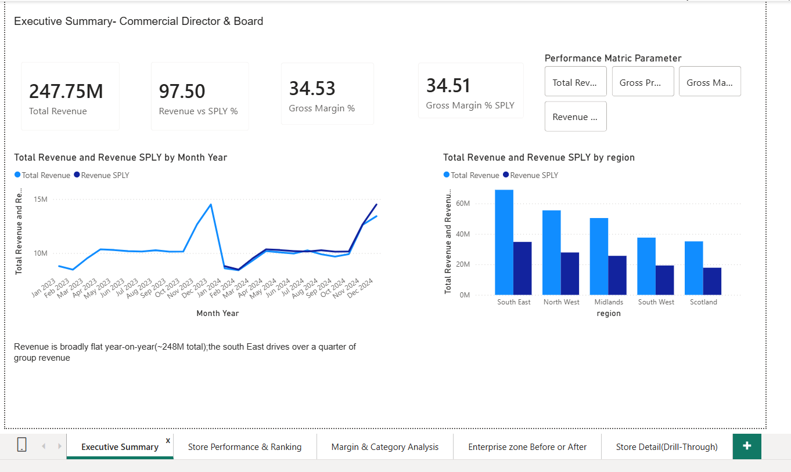
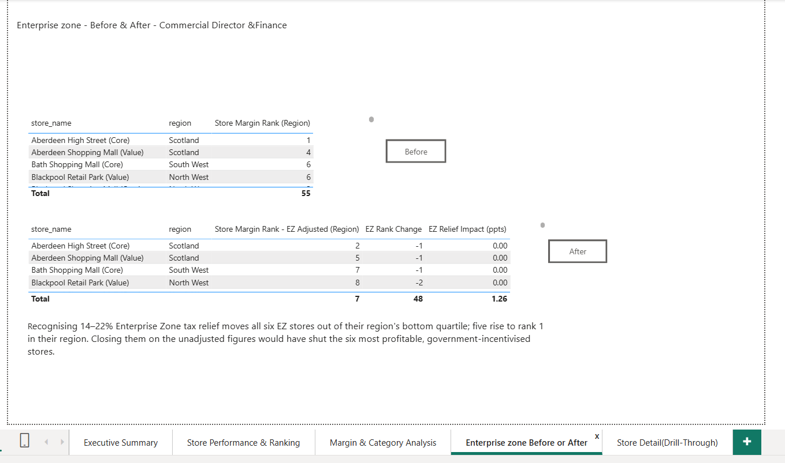
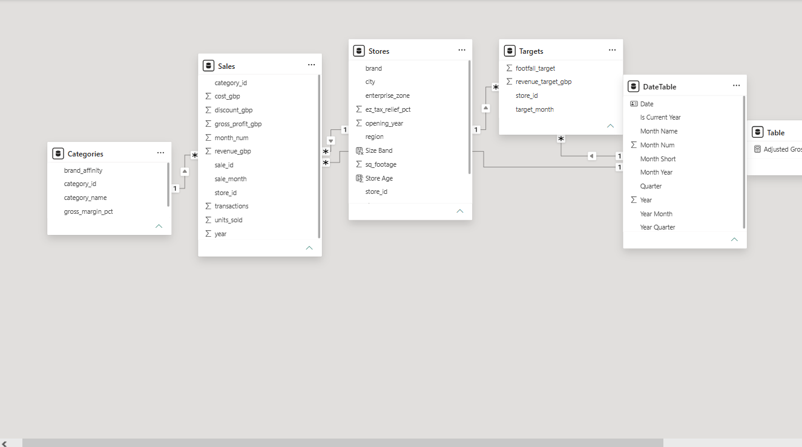

# Apex Retail Group — Advanced Power BI: From Store Rankings to Enterprise Insight

An advanced Power BI solution for a simulated UK multi-brand retailer (60 stores, 5 regions, 3 brands, 24 months of data). Built to answer one Board question — **which stores should be prioritised for investment, and which considered for closure?** — and to show how that answer changes once a hidden cost adjustment is applied.



> Data Analyst Career Programme · Module 5 Advanced (PL-300 advanced topics). All data is synthetic.

---

## The business problem

Revenue has been flat across 2023–2024 (£125.4m → £122.3m). Four stakeholders needed different cuts of the same model:

| Stakeholder | Question | Page |
|---|---|---|
| Commercial Director | Which stores underperform *relative to their region and brand peers*, over 24 months? | Executive Summary · Store Performance & Ranking |
| CFO | Is gross margin compressing year-on-year — and if so, which brand and category is driving it? | Margin & Category Analysis |
| Head of Merchandising | Which categories drag margin down, on a rolling 3-month view? | Margin & Category Analysis |
| Regional Managers | Only my region's stores, ranked within region, against regional targets | RLS-filtered views |

## Headline findings

- **Margin is not the problem.** Blended gross margin held at 34.5% in both years (+0.04 ppts) while revenue dipped 2.5% — the plateau is a volume/mix issue, not a pricing or cost one.
- **Every category sits 0.3–0.6 ppts below its benchmark** — a small but uniform gap pointing to a systemic discount/cost leak. Electronics (17.4%) and Food & Drink (21.4%) dilute the blend; Beauty (54.7%) and Clothing (41.5%) carry it.
- **Every region beat its revenue target (+4.3% to +6.2%)**, which suggests targets are set conservatively and that headline numbers can mask weak individual stores.
- **The Enterprise Zone twist changed the closure list entirely.** Six stores in government Enterprise Zones carried an 8% cost loading but had never had their 14–22% tax relief applied in reporting. On raw margin all six ranked in their region's bottom quartile (~30%). Once relief is applied, all six move to the top of their region (~40–44% margin) — five to rank 1. Closing them on unadjusted data would have shut the most profitable, government-incentivised sites in the estate.



## Data model

Five tables, five active relationships. Two fact tables (Sales, Targets) share the Stores dimension, so target measures use `USERELATIONSHIP` to resolve the ambiguous path.

```
   Categories ──1:*──┐
                     ▼
     Stores ──1:*── Sales ──*:1── DateTable
        │                            │
        └──────1:*── Targets ──*:1───┘
```

| Table | Type | Rows | Notes |
|---|---|---|---|
| `Sales` | Fact | 11,520 | store × category × month; revenue, cost, discount, units, transactions |
| `Targets` | Fact | 1,440 | store × month revenue and footfall targets |
| `Stores` | Dimension | 60 | brand, region, store type, sq footage, `enterprise_zone`, `ez_tax_relief_pct` |
| `Categories` | Dimension | 8 | benchmark `gross_margin_pct` per category |
| `DateTable` | Date | 731 | DAX `CALENDAR` 2023–2024, marked as date table |

Calculated columns on `Stores`: `Store Age`, `Size Band`. Data completeness verified in Power Query — every store appears in every month for all eight categories.



## DAX — 30+ measures, all VAR…RETURN

Full definitions in [`dax/measures.dax`](dax/measures.dax).

| Group | Measures | Key technique |
|---|---|---|
| Foundation | Total Revenue · Total Cost · Gross Profit · Gross Margin % · Total Discount · Discount Rate % · Total Units · Total Transactions · Avg Basket Size · Revenue per Sq Ft | `VAR…RETURN`, `DIVIDE` |
| Targets | Revenue Target · Variance to Target · Variance to Target % | `USERELATIONSHIP` |
| Time intelligence | Revenue YTD · Revenue SPLY · Revenue vs SPLY % · Gross Profit YTD · Gross Margin % SPLY · Revenue Rolling 3M · Revenue Prior Month · Revenue MoM % · Revenue Cumulative | `TOTALYTD`, `SAMEPERIODLASTYEAR`, `DATESINPERIOD`, `DATEADD` |
| Ranking | Store Revenue Rank (Company) · Store Margin Rank (Company) · Store Revenue Rank (Region) · Region Avg Revenue · vs Region Avg % · Is Bottom Quartile (Region) · Store % of Region Revenue | `RANKX` with `ALL` vs `ALLEXCEPT` |
| Dynamic | Dynamic Chart Title · Adjusted Gross Margin % | Field parameter + `SELECTEDVALUE`, What-If parameter |
| Enterprise Zone | EZ Adjusted Cost · EZ Adjusted Gross Profit · EZ Adjusted Gross Margin % · EZ Relief Impact (ppts) · Store Margin Rank – EZ Adjusted (Region) · Is Bottom Quartile – EZ Adjusted | `SUMX` + `RELATED` row-level cost restatement |

**Why ALLEXCEPT, not ALL, for the region rank?** `ALL(Stores)` strips every store filter and ranks each store against all 60. `ALLEXCEPT(Stores, Stores[region])` strips the store filter but *keeps* the region filter, so a store is ranked only against its regional peers — which is what a Regional Manager is accountable for.

## Report pages and interactivity

| Page | Audience | Built with |
|---|---|---|
| Executive Summary | Commercial Director & Board | KPI cards, Revenue vs SPLY line, revenue by region, **field-parameter** metric switcher |
| Store Performance & Ranking | Commercial Director | RANKX table (company + region rank + bottom-quartile flag), brand/region slicers, **drill-through**, **report-page tooltip** |
| Margin & Category Analysis | CFO & Head of Merchandising | Rolling 3-month margin by category, margin vs benchmark, **What-If** margin simulator, variance to target by store |
| Enterprise Zone Before / After | Commercial & Finance Directors | **Bookmark toggle**, rank-change table with **conditional formatting**, EZ Relief Impact per store |
| Store Detail (drill-through) | All stakeholders | 24-month trend, revenue by category, target KPI, store metadata, Back button |

## Row-level security

Six roles — one per region (`[region] = "<name>"` on `Stores`) plus an unfiltered Commercial Director role. Tested with View As; screenshots in [`screenshots/`](screenshots/).

## AI-assisted tasks (Section G)

Copilot was unavailable (no Fabric / Premium licence), so Claude was used as the permitted alternative for three tasks: generating a summary-page layout, explaining the bottom-quartile measure in plain English, and writing a "store % of region revenue" measure. Every output was evaluated and verified against the model — e.g. the AI-written measure was checked to sum to exactly 100% within each region. Full evaluation in [`docs/Apex_SectionG_AI_Tasks.docx`](docs/Apex_SectionG_AI_Tasks.docx).

## Repository structure

```
apex-retail-powerbi/
├── README.md
├── powerbi/        DACP_Advanced_powerBI_Apex_.pbix
├── data/           apex_sales.csv, apex_targets.csv, apex_stores.csv, apex_categories.csv
├── dax/            measures.dax
├── docs/           problem framing, design decisions & insights, AI task evaluation, EZ impact analysis, project brief PDFs
└── screenshots/    five report pages, model view, RLS View-As tests
```

## Skills demonstrated

Advanced DAX (VAR…RETURN, CALCULATE, SUMX, RANKX, ALL/ALLEXCEPT, USERELATIONSHIP) · time intelligence · star schema with multiple fact tables · field & What-If parameters · drill-through, bookmarks, report-page tooltips, conditional formatting · row-level security · critical evaluation of AI-generated output · adapting existing measures to a mid-project requirements change

---

*Mohan Raju Kolikonda · [github.com/Mohan781833](https://github.com/Mohan781833)*
